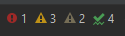
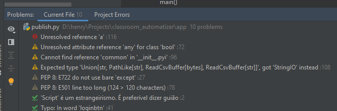

# pythonCrawler

Jorginho é um menino muito esperto, que sabe usar as tecnologias ao seu dispor.
Ele gosta muito de comprar pela internet, mas não confia nas lojas online. [Ele
acha que o preço depende de diversos fatores, como a hora que o usuário acessa
o site, os cookies que seu navegador armazena, e o histórico de compra naquele
site.](https://www.agazeta.com.br/es/economia/lojas-na-web-tem-precos-diferentes-para-cada-cliente-veja-o-que-fazer-1119)

Sendo muito esperto, Jorginho decide contratar Técnicos de Informática para 
programar um [_web crawler_](https://pt.wikipedia.org/wiki/Rastreador_web), 
escrito com a biblioteca
[Selenium](https://github.com/CTISM-Prof-Henry/pythonSelenium), para rastrear
os preços dos produtos que quer comprar, no decorrer de uma semana. 

Ajude Jorginho a decidir qual o melhor preço dos produtos que quer comprar!

## Checklist de atividades

**Dica:** Para marcar um dos _checkboxes_ abaixo, edite o arquivo em Markdown
e troque de `[ ]` para `[x]`.

* [x] [Configure seu ambiente de trabalho.](https://github.com/CTISM-Prof-Henry/pythonEssentials/)
* [x] Escolha um produto para rastrear. Pode ser qualquer coisa: tênis, bolsa,
      sapatos, peças para computador, celulares, passagens de avião, _qualquer 
      coisa_. O produto deve ser único; nenhum outro grupo pode ter escolhido o 
      mesmo produto que você. Todavia, você deve rastrear o preço de diversos 
      produtos. Por exemplo, se o seu grupo escolher rastrear celulares, você 
      irá anotar o preço de **todos** os celulares no site escolhido, no período
      de tempo que seu _web crawler_ rodar.
* [x] Escolha um site para rastrear. O site, obviamente, deve vender o produto
      que você escolheu. O site deve ser único; nenhum outro grupo pode ter 
      escolhido o mesmo site que você.
* [x] Diga qual membro do grupo ficará responsável por qual parte do 
      trabalho. A resposta dada na tabela será checada com os commits do 
      repositório.
* [x] Elabore um fluxograma com o projeto do banco de dados. Salve em um arquivo
      .png e insira-o no arquivo [análise.md](análise.md).
* [x] Especifique o intervalo tempo em que o _web crawler_ ficou rodando. O _web
      crawler_ deve ter rodado em sete ocasiões, porém ele não precisa rodar em 7
      dias consecutivos. Do mesmo modo, o _web crawler_ não precisa ficar rodando
      por diversas horas ininterruptamente; basta colocá-lo para rodar em 7 
      ocasiões.
* [x] Analise os dados. Quais produtos tiveram a maior variação de preço? E os
      que tiveram a menor variação? Ocorreram fatores externos que influenciaram
      na oscilação de preços? (por exemplo, um feriado que fez os preços das 
      passagens aéras ficarem mais caras). Edite o arquivo [análise.md](análise.md),
      respondendo às perguntas acima.
* [x] No arquivo [análise.md](análise.md), insira um gráfico, gerado com a 
      biblioteca [matplotlib](https://matplotlib.org/), e usando os dados 
      que vieram do banco de dados, para auxiliar na explicação da análise. 
      Use o script [gera_gráfico.py](gera_gráfico.py) para gerar o arquivo .png.

## Tabela 

Preencha a tabela abaixo, respondendo às questões que se apresentam. O professor 
irá ler este documento na hora da correção do trabalho.

| Item                             | Resposta            |
|:---------------------------------|:--------------------|
| Produto                          |   TENIS DE HANDEBOL                |
| Site                             |https://www.netshoes.com.br/ |
| Intervalo de datas               |                     |
| Atribuições:                     |                     |
| * Programação do web crawler     |    Bruno            |
| * Elaboração do banco de dados   |    Luize            |
| * Escrita da análise             |    Gianna           |
| * Elaboração do gráfico          |     Gianna        |

## Avaliação

Esta tabela será usada pelo professor para atribuir as notas.

| Critério                                                                                | Pontos (total)      | Pontos obtidos |
|:----------------------------------------------------------------------------------------|--------------------:|---------------:|
| [Qualidade do projeto de banco de dados](#qualidade-do-projeto-de-banco-de-dados)       |                  3  |                |
| [Qualidade do código-fonte do _web crawler_](#qualidade-do-código-fonte-do-web-crawler) |                  4  |                |
| [Qualidade da análise](#qualidade-da-análise)                                           |                  3  |                |

### Critérios

#### Qualidade do projeto de banco de dados

* Número de tabelas adequado ao problema;
* Tipos, nomes e funcionalidades das tabelas adequados ao problema;
* Correto uso de primary keys;
* Relacionamento entre as tabelas faz sentido (e.g. uso de foreign keys);
* [Código-fonte que gera o banco de dados possui poucos problemas](#para-gerar-um-código-fonte-com-poucos-problemas)
    
#### Qualidade do código-fonte do web crawler

* _Web crawler_ coleta corretamente as informações e as insere no banco de dados ;
* Volume de dados coletados é suficientemente grande (i.e. mais de 100 tuplas na tabela);
* [Código-fonte do _web crawler_ possui poucos problemas](#para-gerar-um-código-fonte-com-poucos-problemas)

#### Qualidade da análise

* Poucos erros de português (ortografia, gramática, concordância verbal, etc);
* Explicação é simples, porém bem elaborada;
* O gráfico gerado auxilia na explicação dada no texto;
* O gráfico está customizado; é perceptível que o programador se esforçou
  para deixá-lo bonito;
* [Código-fonte do gerador de gráfico possui poucos problemas](#para-gerar-um-código-fonte-com-poucos-problemas)

#### Para gerar um código-fonte com poucos problemas

* Tente minimizar ao máximo o número de **errors, warnings, week warnings**
    * Typos podem ser ignorados sem problema
    * Esta tela fica no canto superior direito da tela do Pycharm: 
      
    * Já a tela abaixo aparece quando acessamos o Menu 
      `View -> Tool Windows -> Problems`:

      
