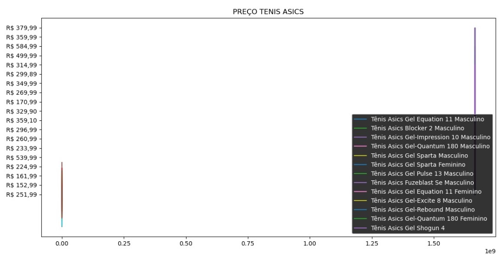

# Diagrama Banco de Dados

# Análise
Durante o período de análise, correspondente a 4 dias, não consecutivos, 
(o código foi rodado 7 vezes durante esse período), os produtos analisados 
não sofreram alterações em seus valores no site. Durante as ocasiões em que o  
web crawler  foi rodado não houve nenhum fator, como feriados, 
que alterasse o valor dos produtos. 

Durante os testes foi observado a sobreposição de alguns itens. 
Porém foi possível analisar os dados a partir da alteração de cores do gráfico, 
facilitando a visualização individual dos itens. 

## Gráfico

