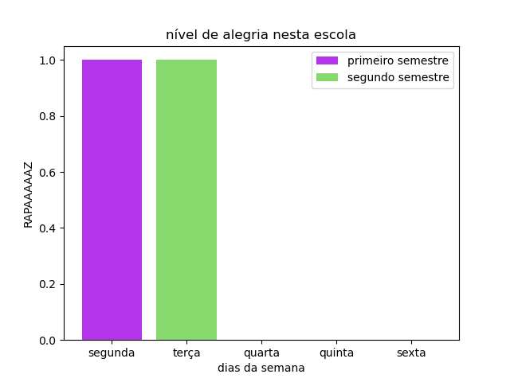

# Análise

Este arquivo é um exemplo da análise que você escreverá.

Você deve escrever um pequeno texto analisando os dados coletados.

## Gráfico

O gráfico que será gerado com a biblioteca matplotlib deve fazer uma consulta
ao banco de dados. Verifique o exemplo que acompanha este repositório.

Uma galeria de exemplos de gráficos que o matplotlib pode gerar está 
[neste link](https://matplotlib.org/stable/gallery/index.html).

