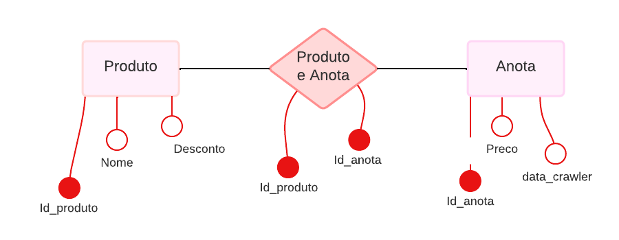

# Diagrama Banco de Dados

# Análise
Durante o período de análise, correspondente a 4 dias, não consecutivos, 
(o código foi rodado 7 vezes durante esse período), os produtos analisados 
não sofreram alterações em seus valores no site. Durante as ocasiões em que o  
web crawler  foi rodado não houve nenhum fator, como feriados, 
que alterasse o valor dos produtos. 

## Gráfico
O gráfico não gera as informações armazenadas no banco de dados por conta de 
uma sobreposição de dados, e não consegue gerar uma coluna de análise devido a um 
problema não identificado no gera_gráfico. 

